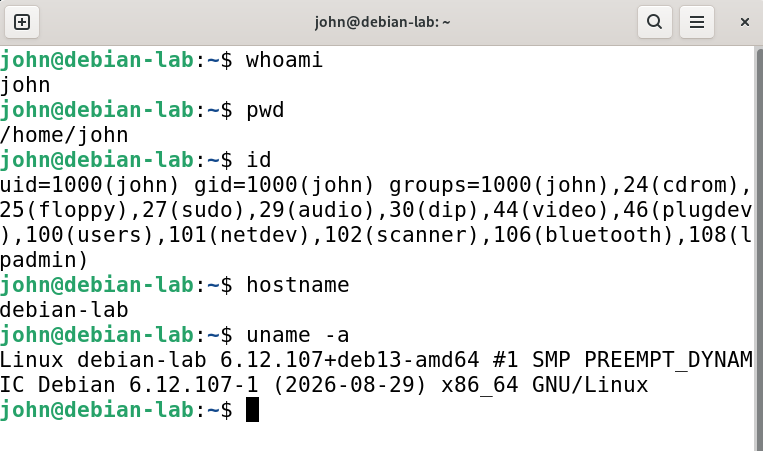
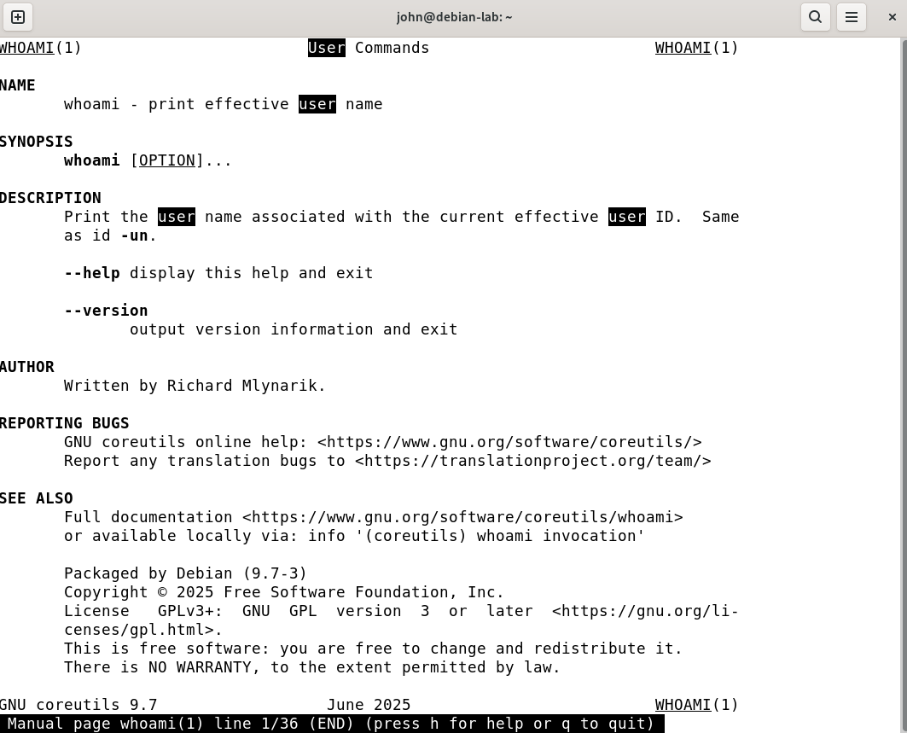

# U1-05b Assignment: Linux CLI Basics

**Date:** 2026-09-06   <br>
**Source:** U1-05b Assignment: Linux CLI Basics  <br>
**Environment:** Debian 13 VM, Linux  

## Goal
What I was trying to do.

## Steps
### Part 1 Getting your bearings

Komento: ```whoami```  Tuloste: ```john```

Komento: ```pwd``` Tuloste: ```/home/john```

Komento: ```id```   
Tuloste: ```uid=1000(john) gid=1000(john) groups=1000(john),24(cdrom),25(floppy),27(sudo),29(audio),30(dip),44(video),46(plugdev),100(users),101(netdev),102(scanner),106(bluetooth),108(lpadmin)```

Komento: ```hostname```  Tuloste: ```debian-lab```

Komento: ```uname -a```  
Tuloste: ```uid=1000(john) gid=1000(john) groups=1000(john),24(cdrom),25(floppy),27(sudo),29(audio),30(dip),44(video),46(plugdev),100(users),101(netdev),102(scanner),106(bluetooth),108(lpadmin)```

### Q1: What username are you logged in as?   <br>
Käyttäjänimi on john.    <br>
### Q2: Are you a member of the sudo group? How can you tell from the output of id?    <br>
Kyllä, olen sudo-ryhmän jäsen. Sen näkee id-komennon tulosteesta ryhmälistauksessa olevasta merkinnästä 27(sudo).   <br>
### Q3: What kernel version is your system running?  <br>
Versio 6.12.107+deb13-amd64.   <br>
- Find out what whoami is for using two different help tools   <br>
        <br>
### Q4: What is the difference in the depth of information they give you?   <br>
```whatis``` antaa hyvin lyhyen, yhden rivin tiivistelmän komennon tarkoituksesta. ```man``` tarjoaa laajan ja yksityiskohtaisen käyttöohjeen.
### Q5: While in man, how do you (a) search for the word "user" and (b) quit?    <br>
(a) Hae sana kirjoittamalla ```/user``` ja painamalla Enter.  (b) Poistu manuaalista painamalla kirjainta ```q```.  <br>

### Part 2 Navigation

## Findings
What I learned / what the output told me.

## Issues and how I resolved them
Problems encountered, fixes applied.

## References
Links to docs, write-ups, or related notes.
