# U2-03b Assignment: Personal Device Hardening Checklist

**Date:** 2026-09-19  
**Source:** U2-03b Assignment: Personal Device Hardening Checklist  
**Environment:** Debian 13 VM

## Goal
Toteuttaa ja dokumentoida Debian 13 -virtuaalikoneelle konkreettiset eri tavat suojata järjestelmää.

## Steps
### Hardening checklist
### Operating system
- 1\. ✅ OS is currently supported and receiving security updates.

Tarkistin käyttöjärjestelmän version `cat /etc/os-release`. Käytössä on Debian 13 (trixie), joka on voimassa oleva ja tuettu versio.

- 2\. ✅ Automatic security updates are enabled

Tarkistaa onko automaattiset turvapäivitykset käynnissä.

Ei, joten asensin ja konfiguroin automaattiset turvapäivitykset.  

 
   

- 3\. ✅ All pending updates installed

Järjestelmän päivitys komennolla `sudo apt update && sudo apt upgrade -y`. Kaikki saatavilla olevat paketit ja turvapäivitykset ovat asennettuina.

  
   

### Authentication
- 4\. ✅ Strong login password or PIN set (not blank, not reused)

Käyttäjätilin salasana tilan varmistaminen komennolla `sudo chage -l john`. Käyttäjälle on asetettu vahva ja yksilöllinen salasana asennuksen yhteydessä.

- 5\. ✅ Screen lock automatically activates within 5 minutes of inactivity   

Komento, joka näyttää nykyisen lukitusviiveen sekunteina.   

  

Lukitusviive on jo valmiina asetettu 5 minuuttiin. Ja varmistus vielä, että automaattinen näytönlukitus on aktivoituna päälle.   

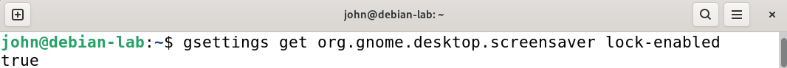     

- 6\. N/A Biometric login configured (where supported) as a convenience layer, not as the only factor

Käytössä on Debian 13 -virtuaalikoneympäristö, jossa ei ole kytkettynä biometrista laitteistoa (kuten sormenjälkilukijaa). Ajamalla komento `fprintd-enroll`, joka ilmoitti, ettei yhteensopivaa laitetta ole saatavilla.  

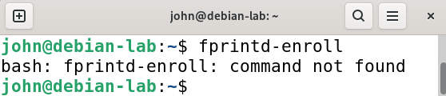

### Storage and data
- 7\. N/A Full-disk encryption enabled (BitLocker, FileVault, LUKS)

Levyn salauksen tarkistus. Käytössä oleva Debian 13 VM ei hyödynnä kokolevynsalausta, sillä se on asennettu kevyeksi harjoitusympäristöksi. Arkikäytössä olevilla laitteilla salaus kytketään päälle asennusvaiheessa.   

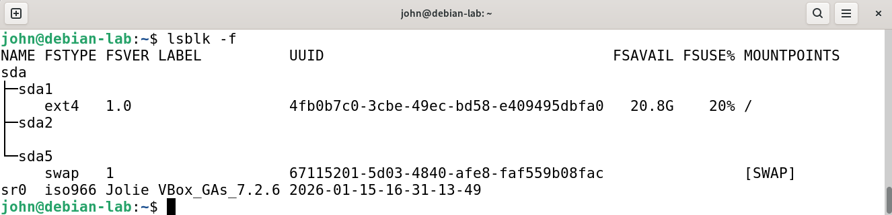

- 8\. ✅ At least one recent backup exists in a separate location (external drive or cloud)

Varmuuskopio tiedosto.   

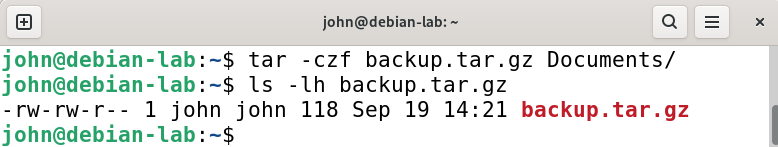

- 9\. ✅ Backup restoration tested at least once (try restoring a single file)

Varmuuskopion palautusta purkamalla se väliaikaiseen hakemistoon.  

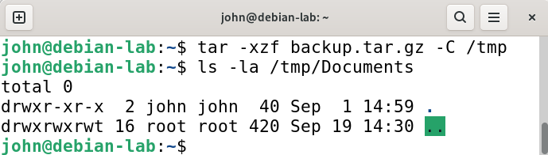

### Network
- 10\. ✅ Host firewall enabled

Isäntäpalomuurin tilan tarkistaminen. 

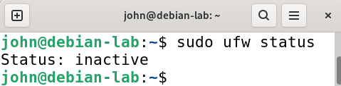

Palomuuri ei ole päällä, joten palomuurin pitää käynnistää.  

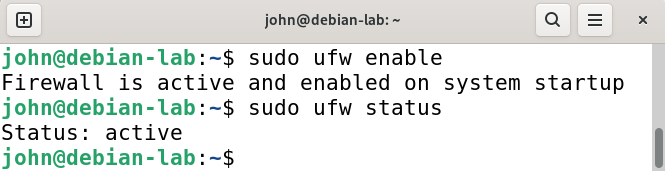

- 11\. ✅ Network profile correctly set (public/private) for your current network

Aktiivinen verkkoyhteys ja sen profiilin tarkistaminen.

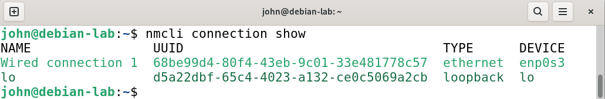

- 12\. ✅ Unnecessary sharing services (file sharing, remote desktop) disabled when not needed

Löydetyt palvelut.

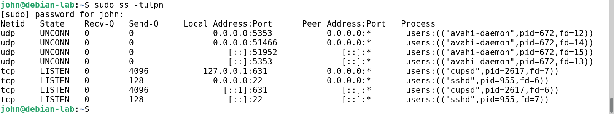

Avahi ja CUPS sulkeminen.

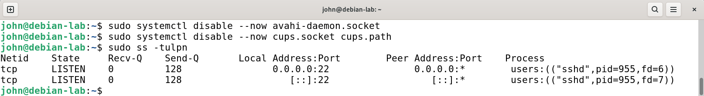

### Software
- 13\. ✅ Browser is up to date

Firefox selaimen päivitystä.

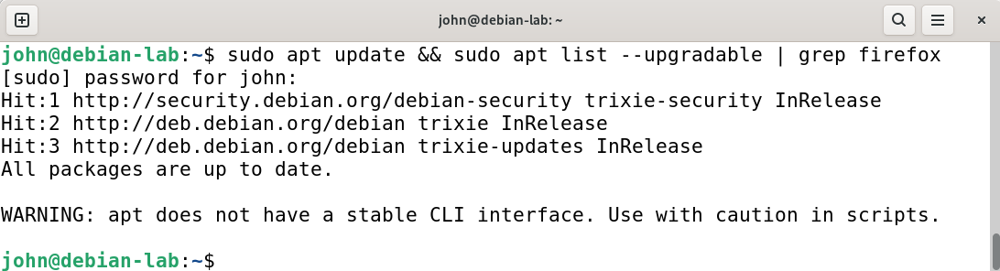

- 14\. ✅ Reputable anti-malware solution present (built-in Defender is acceptable on Windows)

Asensin ClamAV-virustorjunnan. 

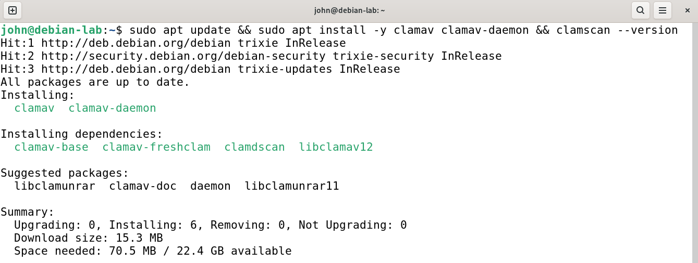

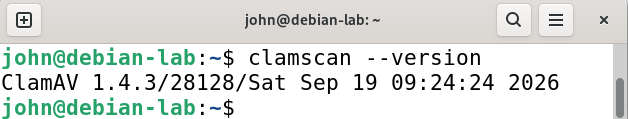

- 15\. ✅ Unused applications uninstalled (list 3+ you removed)

3 pelisovellusta. gnome-mines, gnome-sudoku ja aisleriot.

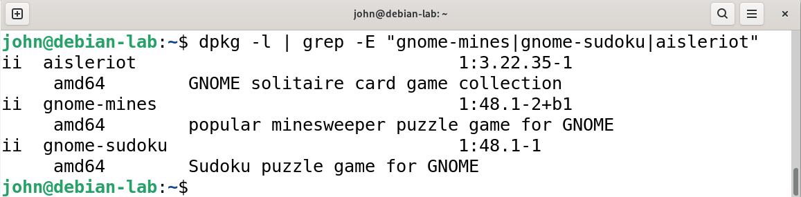

Ylimääräiset sovellukset ja niiden konfiguraatioiden poistaminen.

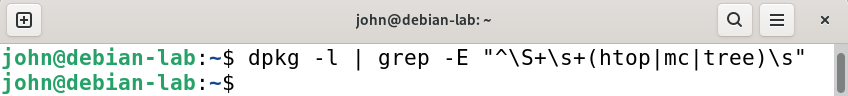

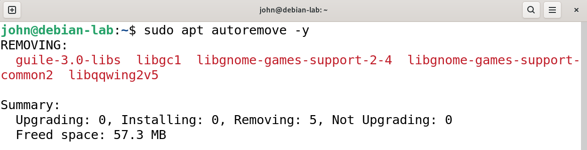

Sama komento uudelleen osoittaakseen, että sovellukset on poistettu.

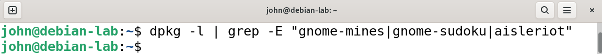

### Accounts

- 16\. ✅ Local administrator account renamed or disabled where possible; daily-use account is non-admin

Tavallinen käyttäjä

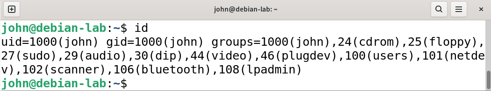

- 17\. ✅ Guest account disabled

Tarkistin, että järjestelmässä ei ole aktiivista vierastiliä. Komento palauttaa täysin tyhjän rivin, eli järjestelmässä ei ole vierastiliä.

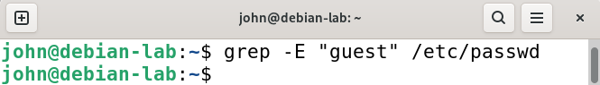

### Physical

- 18\. ⚠️ partial. Cable lock or secure storage option identified for travel/public use

Laitteen fyysinen turvallisuus matkustaessa ja julkisissa tiloissa varmistetaan Kensington-vaijerilukolla, jolla tietokone kiinnitetään kiinteään rakenteeseen. Kun laite ei ole välittömässä käytössä tai sitä kuljetetaan, sitä säilytetään lukittavassa laukussa tai lukittavassa kaapissa.

- 19\. ✅ Laptop's "find my device" or equivalent feature enabled

Tarkistin oliko jo asennettuna taustalla aktiivista paikannuspalvelua. Oli, mutta ei päällä.

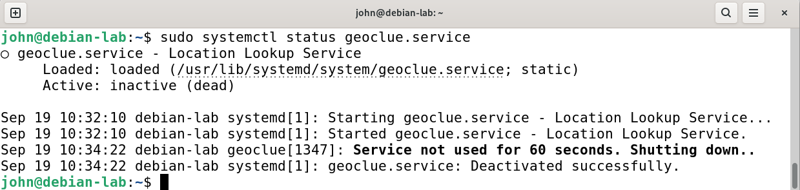

Kytkin sijaintipalvelut päälle asetuksista.

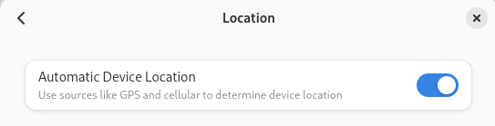

Paikannuspalvelu `geoclue.service` on aktiivinen ja pyörii taustalla, mikä mahdollistaa laitteen verkkopohjaisen paikannuksen käyttöjärjestelmätasolla.

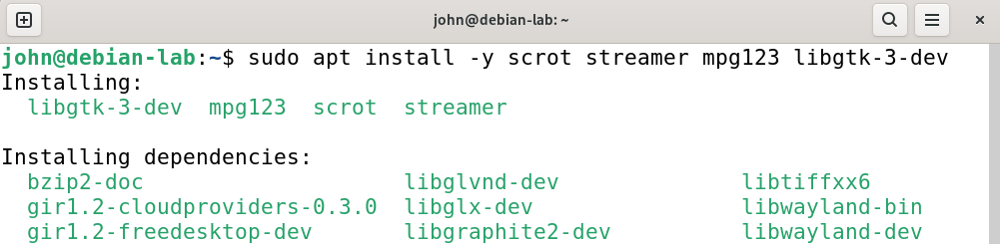

20\. ✅ You know how to remotely wipe the device if lost

Tarkistin laitteen levynrakenteen, jossa määritettiin koko fyysinen levy /dev/sda

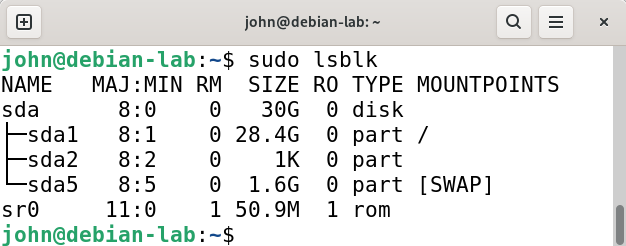

Katoamistilanteessa levy ylikirjoitetaan komennolla: `sudo dd if=/dev/urandom of=/dev/sda bs=1M status=progress`

Komennon parametrit on tunnistettu.

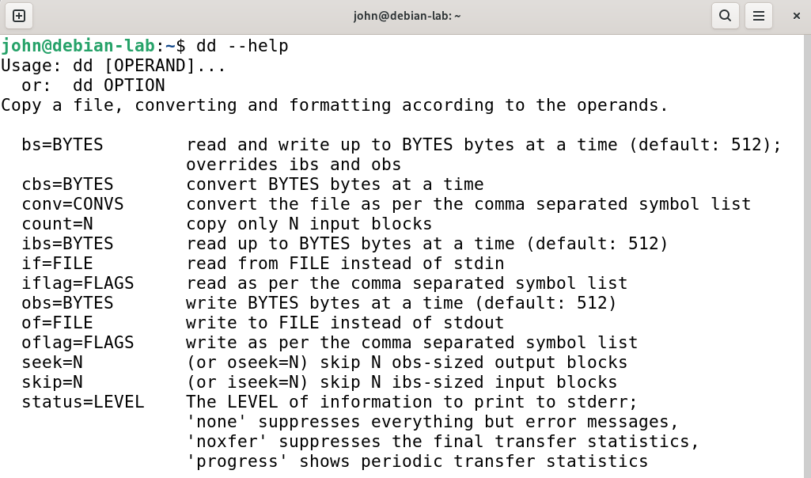

### A short reflection (150 words): which change had the biggest security impact, and which was the most inconvenient?

Muutos millä oli suurin turvallisuusvaikutus oli palomuurin päälle käynnistäminen, mikä auttaa turvaamaan laitetta viruksilta. Hankalin muutos toteuttaa oli kolmen pelisovelluksen poistaminen. Poistamisen yhteydessä poistui myös muita taustaprosesseja joka vaikeutti poiston kohdistamisen vain haluamiin sovelluksiin. Oikean komennon määrittämisessa meni aikaa.
