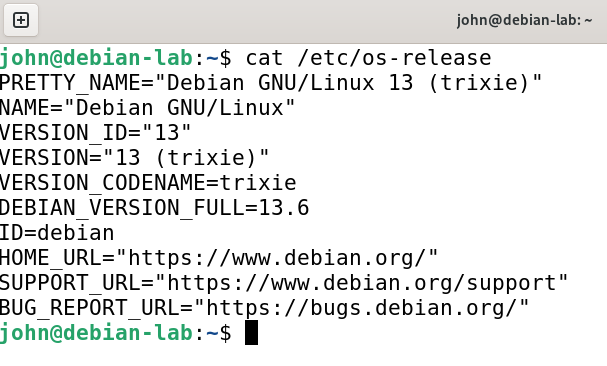
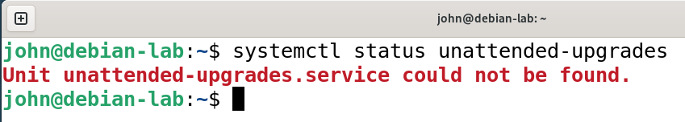
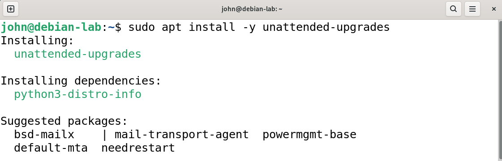
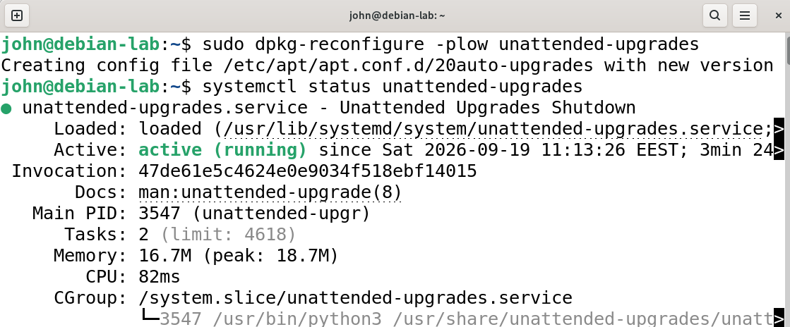
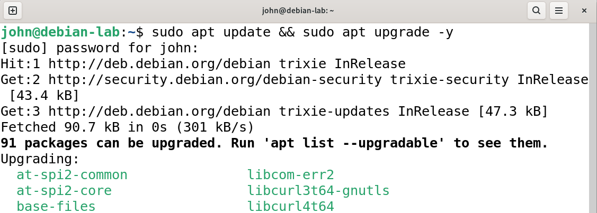
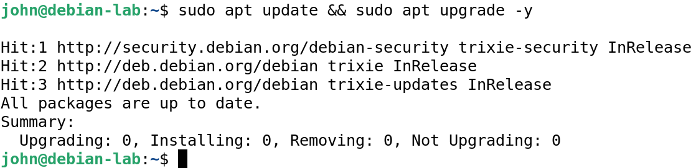
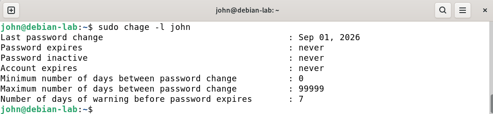
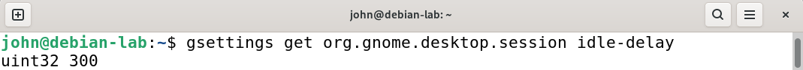

# U2-03b Assignment: Personal Device Hardening Checklist

**Date:** 2026-09-19  
**Source:** U2-03b Assignment: Personal Device Hardening Checklist  
**Environment:** Debian 13 VM

## Goal
What I was trying to do.

## Steps
### Hardening checklist
### Operating system
1. ✅ OS is currently supported and receiving security updates.

Tarkistin käyttöjärjestelmän versio komennolla `cat /etc/os-release`. Käytössä on Debian 13 (trixie), joka on voimassa oleva ja tuettu versio.

2. ✅ Automatic security updates are enabled

Tarkistaa onko automaattiset turvapäivitykset käynnissä.

Ei, joten asensin ja konfiguroin automaattiset turvapäivitykset.  
 
   

3. ✅ All pending updates installed

Järjestelmän päivitys komennolla `sudo apt update && sudo apt upgrade -y`. Kaikki saatavilla olevat paketit ja turvapäivitykset ovat asennettuina.

  
   

### Authentication
4. ✅ Strong login password or PIN set (not blank, not reused)

Käyttäjätilin salasana tilan varmistaminen komennolla `sudo chage -l john`. Käyttäjälle on asetettu vahva ja yksilöllinen salasana asennuksen yhteydessä.

5. ✅ Screen lock automatically activates within 5 minutes of inactivity   

Komento, joka näyttää nykyisen lukitusviiveen sekunteina:   

Lukitusviive jo valmiina asetettu 5 minuuttiin. Varmistus vielä, että automaattinen näytönlukitus on aktivoituna päälle.
## Findings
What I learned / what

## Issues and how I resolved them
Problems encountered, fixes applied.
